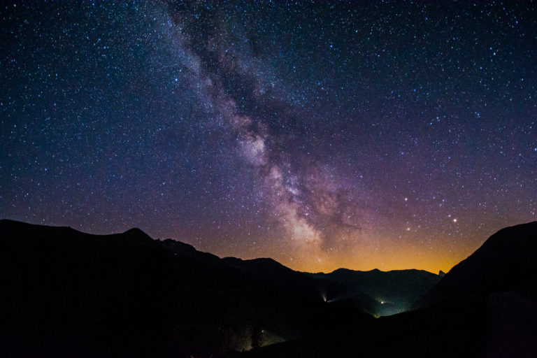

+++
title = "Aufbruch ins Unbekannte: Die Zukunft der Menschheit im Weltraum"
date = "2023-06-01"
draft = false
pinned = true
tags = ["Reportage", "Deutsch"]
image = "reportage_zukunft.jpg"
description = "Die Erde stößt an ihre Grenzen: Die Bevölkerung wächst, die Ressourcen schwinden und der Platz wird knapp. Doch was, wenn wir einen Ausweg hätten? Die Antwort scheint im Weltall zu liegen. Aber wie sollen wir dorthin gelangen und woher nehmen wir die benötigten Mittel? Wir haben recherchiert und waren auf der Suche nach Antworten."
+++


Auf unserer Reise haben wir viel über die Vor- und Nachteile dieser Flucht gelernt. Wir haben ein Sachbuch gelesen und Ben Moore, ein Astrophysiker an der Universität Zürich und Fachmann im Bereich, sowie Dominik Joss, ein Geschichtslehrer am Gymnasium Kirchenfeld, befragt, um Informationen und Meinungen zum Thema zu erhalten. 



***Eine Reportage von Said Khalef und Nestor Borter***

Der Klimawandel ist schon seit längerer Zeit ein gravierendes Problem für die Menschheit. Er droht unseren momentanen Lebensort, unbewohnbar zu machen. Das heisst, wir müssen den Klimawandel so gut es geht stoppen, aber dies ist leider schon fast zu spät. Daher scheint die Flucht auf einen neuen Planeten der einzige Weg zu sein dem Klimawandel zu entkommen. Doch wohin zuerst? Naja, dieses Ziel ist näher, als man denkt.

## Energie und Ressourcen

Die Frage nach der Energieversorgung ist ein entscheidendes Thema des Klimawandels und für die Zukunft der Menschheit. Vor allem, wenn es um die Besiedlung anderer Planeten geht. Denn ohne ausreichende Energieversorgung können wir nicht einmal eine Mission starten, geschweige denn einen lebensfähigen Ort auf fremden Himmelskörper errichten. Doch dieser Mangel an Energie könnte nicht nur ein Problem, sondern auch eine Gelegenheit für den Fortschritt sein. Denn durch die Entdeckung und Erschließung neuer Planeten könnten wir nicht nur mehr Ressourcen für die Energiegewinnung nutzen, sondern auch effizientere und nachhaltigere Energiequellen entwickeln. 

> "Unsere Energiequellen sind zurzeit grösstenteils nicht nachhaltig" – Dominik Joss

Ein vielversprechendes Konzept neben einer Dyson-Sphäre, welche noch weit in der Zukunft liegt, ist Fusionsenergie. Hierbei wird Energie durch die Verschmelzung von Atomkernen gewonnen, ähnlich wie bei der Energieerzeugung in der Sonne. Dieses Verfahren ist nicht nur effizienter als herkömmliche Energieerzeugung, sondern auch umweltfreundlicher und sicherer.


Eine Dyson Sphäre ist eine Riesenkonstruktion, welche einen ganzen Stern umschliesst, um dadurch alle möglichen Ausschüttungen von Wärmeenergie einzufangen und für sich zu gewinnen. 



Das Experteninterview bestätigt diese Ansicht. Denn Professor Dr. Ben Moore sieht in der Fusionsenergie eine vielversprechende Energiequelle für die Zukunft und eine Eintrittskarte zu nahezu grenzenloser Energie. Seine Meinung bestätigt sich durch seine Vereinfachung des Prozesses.

> "Getting energy from simple water” – Ben Moore

Die Erschließung neuer Planeten und die Entwicklung effizienterer Energiequellen könnten somit nicht nur zur Lösung der Energieprobleme beitragen, sondern auch neue wissenschaftliche Erkenntnisse und Technologien hervorbringen. Mit dem richtigen Einsatz von Energie und Technologie könnten wir jetzige Probleme meistern und uns auf eine erfolgreiche Zukunft im Weltraum vorbereiten.
Außer den neuen Arten Energie zu gewinnen, gibt es auch neue Arten Ressourcen zu kriegen. Ressourcengewinnung von Asteroiden und anderen Planeten wird nämlich zunehmend zu einem Thema von großem Interesse für Wissenschaftler und Raumfahrtunternehmen. Mit der zunehmenden Übernutzung von Ressourcen auf der Erde wird der Abbau von Rohstoffen auf anderen Himmelskörpern immer attraktiver. Die Idee Asteroiden für Mineralien und andere Ressourcen zu ernten, wird schon von vielen Weltraumunternehmen in Betracht gezogen. Einige dieser Unternehmen sind schon dabei, die Technologien für den Abbau von Rohstoffen auf Asteroiden zu entwickeln. Dabei geht es um eine Vielzahl von Materialien, einschließlich wertvoller Metalle wie Platin, Palladium und Gold, aber auch wertvollere Mineralien, welche für Forschungen brauchbar sind. 
Zudem sind andere Planeten, wie der Mars, auch potenzielle Quellen für wertvolle Ressourcen. Mit seiner kargen Oberfläche und seinen reichen mineralischen Ressourcen könnte der Mars für Bergbauunternehmen ein attraktives Ziel werden. Dabei geht es vor allem um Rohstoffe, die für den Aufbau einer Kolonie auf dem Planeten benötigt werden.
Die Ressourcengewinnung auf Asteroiden und anderen Planeten bietet enorme Möglichkeiten für die Menschheit. Allerdings gibt es auch Bedenken hinsichtlich der Auswirkungen auf den Planeten oder den Asteroiden und seine Umgebung. Es ist wichtig, dass die Raumfahrtunternehmen und Wissenschaftler sich auf eine umweltfreundliche und nachhaltige Ressourcengewinnung konzentrieren, um sicherzustellen, dass die Auswirkungen auf die Umwelt minimiert werden. 

## Finanzierung der Mission

> "Geld ist und bleibt ein Problem"

kriegen wir als Antwort, wenn wir Dominik Joss, nach seiner Meinung zur Finanzierung der Mission fragen. Und das ist auch kein Wunder, denn wie sollen wir genügend Einnahmequellen finden, wenn der Erfolg der Mission keineswegs garantiert ist? Doch es gibt bereits eine vielversprechende Lösung für diese Herausforderung. Denn es gibt bereits mutige Privatpersonen wie Elon Musk, die ihr eigenes Vermögen in das Projekt investiert haben und dabei eine Zukunft sehen, in der sich diese Investitionen für sie auszahlen werden.

## Das erste Ziel

Der am nächsten gelegene Ort, bei dem wir weitere Lebensräume errichten könnten, wäre der Mond. Seit der ersten bemannten Mondlandung im Jahr 1969 hat sich unser Wissen über den Mond erheblich erweitert, aber das Leben auf dem Mond bleibt eine enorme Herausforderung. Wie Ben Moore sagte:

> "The biggest problem is the atmosphere"

ist das Hauptproblem das Fehlen einer Atmosphäre, die den Mond vor schädlicher Strahlung und Partikeln aus dem Weltall schützt. Es hat zwar eine sehr geringe Atmosphäre, welche aber viel zu undicht wäre, um dort ein Leben zu führen. 

Zusätzlich stellt auch die extreme Temperaturdifferenz auf dem Mond eine Herausforderung dar, bei der die Temperatur tagsüber bis auf 120 Grad Celsius ansteigen kann und nachts bis auf -170 Grad Celsius sinkt. Es würde viel Geld kosten, um die Temperatur bei einer Mondbasis so zu stabilisieren, dass wir dort leben könnten. 

Der erste Schritt, für eine Mondbasis wäre, eine weitere Erkundung des Mondes, um den besten Ort für die Basis zu finden. Ein Ort mit einer stabilen Oberfläche, Zugang zu Ressourcen wäre von großer Bedeutung. Um diese Ressourcen zu nutzen, müssten Roboter und bemannte Missionen geschickt werden, um den Mondboden zu erkunden. Sobald der ideale Standort gefunden ist, müssten Baupläne für die Mondbasis erstellt werden. Die Basis könnte in Stücken aufgebaut werden und aus verschiedenen Abteilungen oder Zimmern bestehen, die von der Erde ausgeschickt und auf dem Mond zusammengebaut werden könnten. Ein weiterer wichtiger Schritt wäre die Schaffung von Lebensbedingungen in der Mondbasis. Die Basis müsste mit ausreichender Luftversorgung, Wassergewinnungs- und Recyclinganlagen, Nahrungsmittelproduktion und medizinischer Ausrüstung ausgestattet sein, um die Astronauten am Leben zu halten.

Sobald wir es geschafft haben, den Mond zu unserem Gebiet zu machen, können wir beginnen uns an grössere Missionen zu wagen, wie zum Beispiel die Besiedlung vom Mars. 

## Das Leben mitten im Weltraum

Ein weiterer Ort, an dem die Menschheit praktisch unendlich ausbreiten und das Platzproblem lösen könnte, wäre mitten im Weltraum. Die Idee klingt zwar utopisch, aber in Zeiten, in denen das Bevölkerungswachstum und die Ressourcenknappheit immer bedrohlicher werden, ist es notwendig, innovative Lösungen zu suchen. Natürlich wäre Sauerstoff eine der größten Herausforderungen für das Leben im Weltall, da es keinen natürlichen Vorrat gibt. Man müsste ein geschlossenes System machen, in dem der Sauerstoff nicht entweichen kann. Eine Möglichkeit wäre, den Sauerstoff mit großen Ladungen dorthin zu transportieren, aber das wäre nicht sehr nachhaltig. Eine andere Lösung wäre, ein eigenes Ökosystem im Weltraum zu schaffen, indem wir Pflanzen anpflanzen und damit Sauerstoff produzieren. Mit dieser Methode könnten wir die Bevölkerung im Weltall unabhängig von der Bevölkerung hier auf der Erde machen und so möglicherweise einige der Probleme unserer Menschheit lösen.

## Transport und Kommunikation

In der Zukunft wird uns der Transport von Ressourcen und Personen eine Herausforderung stellen. In der Vergangenheit und auch noch aktuell müssen Raketen und Raumfahrzeuge mit ausreichend Treibstoff und Lebensmitteln ausgestattet werden, um lange Reisen durch das Weltall zu ermöglichen. Doch dies ist teuer und aufwendig. Deshalb arbeiten Forscher daran, effizientere Methoden zu finden, um Raumfahrzeuge mit weniger Treibstoff längere Strecken zurücklegen zu lassen. Ein Beispiel dafür ist die Firma „SpaceX“, welche sich schon seit mehreren Jahren mit der effizienten Raumfahrt auseinandersetzt. 


SpaceX ist ein Raumfahrtunternehmen, das den Zugang zum Weltraum vereinfachen und den Mars kolonisieren will. Sie bauen wiederverwendbare Raketen und waren das erste private Unternehmen, das Menschen ins All beförderte.



Eine mögliche Option, um die Umsiedlung in den Weltraum zu erleichtern, ist der Bau eines Weltraum-Lifts. Dieser Lift könnte aus einem senkrechten Seil oder einer ähnlichen Konstruktion bestehen und Raumfahrzeuge entlang dieses Seils beschleunigen, um schneller und ressourceneffizienter in den Weltraum zu gelangen. Die Idee einer solchen Konstruktion gibt es bereits seit über 120 Jahren, doch damals fehlten die Materialien, um ein solch stabiles Seil aufzustellen. Heute können wir diese Materialien herstellen, jedoch bleibt das Problem, wie wir das schwere Material in die Höhe befördern. 

Anstatt uns nur auf den Transport zu konzentrieren, müssen wir auch eine bessere Methode finden, um zwischen diesen langen Distanzen zu kommunizieren. Momentan ist die schnellste Methode, die wir zur Übermittlung von Nachrichten verwenden können, ein Lichtsignal. Doch diese Technologie wird heutzutage nicht sehr oft genutzt, und um die Zukunft unserer Weltraumexpeditionen zu sichern, müssen wir uns auf diese Methode konzentrieren. 

Wenn wir eines Tages andere Sterne besiedeln wollen, könnte uns das Problem der Kommunikation in die Quere kommen. Ben Moore hat treffend darauf hingewiesen: “Communication can’t get any better because, as Einstein said, nothing can travel faster than light”. Das bedeutet, dass es unmöglich ist, Signale schneller als die Lichtgeschwindigkeit zu übertragen. Um ein Signal zum nächstgelegenen Stern zu senden, würde es etwa viereinhalb Jahre dauern. Dieses Hindernis stellt uns vor eine große Herausforderung, die unsere Zukunft im Weltraum limitiert.

## Fazit

In dieser Reportage haben wir uns mit der Frage beschäftigt, welche Schritte noch notwendig sind, damit wir Menschen uns vollständig von der Erde lösen und andere Planeten bevölkern können. Wir haben uns dabei mit verschiedenen Ideen zur Energiegewinnung, den möglichen Erscheinungsbildern interstellarer Zivilisationen und den Finanzierungsmöglichkeiten auseinandergesetzt. Trotz der Befragung von Experten bekamen wir keine klare Antwort. Die Zukunft der Raumfahrt ist noch unbekannt und es bleibt abzuwarten, ob wir uns tatsächlich auf den Weg machen werden, den Weltraum zu erforschen. Wir hoffen aber, dass wir nicht nur Zuschauer des Universums bleiben, sondern auch daran teilhaben werden. Es ist unser Wunsch, dass unsere Nachkommen in einer Welt leben werden, in der die Erde nicht mehr unsere einzige Zuflucht ist.